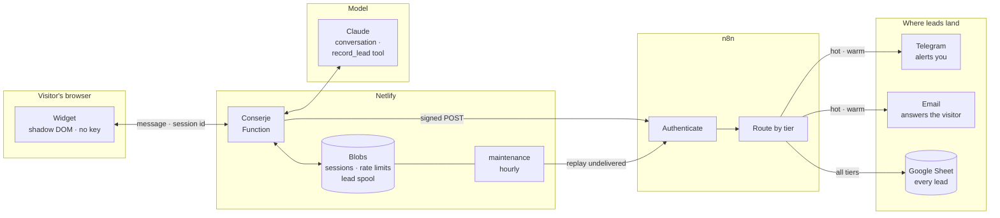
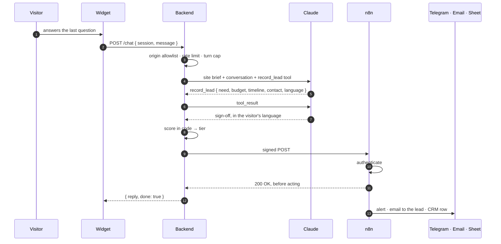
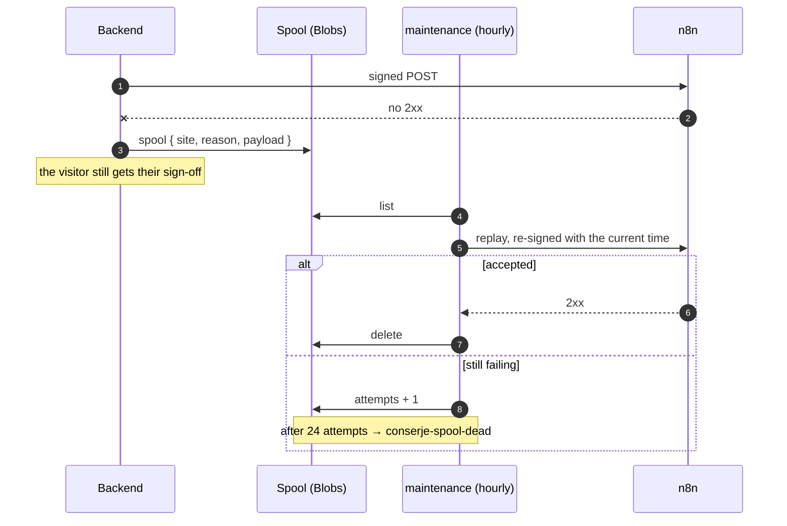

# Conserje

An embeddable chat widget that qualifies website visitors and routes them as
scored leads through n8n.

A contact form tells you someone typed an email address. It does not tell you
whether they have a budget, a deadline, or a problem you can actually solve.
Conserje has a short conversation instead, extracts a structured brief, scores
it, and sends it where it needs to go — a notification for the leads worth
dropping everything for, a spreadsheet row for the rest.

It is the chat on [carlosrendon.co](https://carlosrendon.co): real visitors,
real leads, every day.

## See it work

Short clips, each one feature, recorded against the live deployment. The
walkthrough that produced them, with every message typed, is in
[docs/demo.md](docs/demo.md) ([en español](docs/demo.es.md)); it also covers
what the clips do not yet show — replies in the visitor's language, surviving
an n8n outage, and adding a second site.

**1 · A conversation becomes a lead** — a short conversation in place of a
form, then the same lead in three places seconds later: a Telegram alert, an
email to the visitor, a row in the sheet.

https://github.com/user-attachments/assets/510c75e7-bcac-4029-813d-18735f130dbc


**2 · Hot, warm, cold** — three conversations, three routes through n8n, and a
score computed in code rather than guessed by the model.

https://github.com/user-attachments/assets/36d6c60d-0288-46e7-b830-0a5d8b2487cf

## How it works

The widget never sees a credential, a prompt, or a score. It posts a message
and an opaque session id, and renders what comes back.

> **[Step through it →](https://carlosrendonduque.github.io/conserje/)**
> The three paths as an interactive schematic: one turn of conversation,
> recording a lead, and what happens when n8n is down.



**Two things this drawing is making a point about.** Nothing the model says
reaches n8n directly: it calls a tool with facts, and the backend turns those
into a score in code. And there is a way back from every failure — a lead that
n8n does not accept goes to the spool and is replayed, so an outage costs time,
not leads.

### What happens when a visitor becomes a lead



### What happens when n8n is down



## What is in the box

| Directory  | What it holds |
|------------|---------------|
| `widget/`  | The embeddable widget. Vanilla JS in a shadow root, no dependencies, 15.5 KB built. |
| `server/`  | TypeScript on Node 22.6+. Holds the API key, drives the conversation, scores leads, signs webhooks. Deploys as a Netlify Function. |
| `sites/`   | One JSON file per site. Adding a client is a config file, not a code change. |
| `n8n/`     | Self-hosted n8n via Docker Compose, plus the workflows as version-controlled JSON. |
| `docs/`    | Install, architecture, security, the n8n setup, and the demo walkthrough. |
| `examples/` | A fictional second site, used by the demo. |

## Quick start

```bash
# 1. Backend
cd server
npm install
cp .env.example .env          # add your ANTHROPIC_API_KEY
node --experimental-strip-types --env-file=.env bin/serve.ts

# 2. Widget
cd ../widget
node build.mjs
node serve-demo.mjs           # http://localhost:8080

# 3. n8n (optional for a first look)
cd ../n8n
cp .env.example .env          # add the same CONSERJE_WEBHOOK_SECRET
docker compose up -d          # http://localhost:5678
```

Full walkthrough in [docs/INSTALL.md](docs/INSTALL.md). Putting the widget on a
page: [docs/EMBEDDING.md](docs/EMBEDDING.md).

## Adding a site

Drop a JSON file in `sites/`. The filename must match the `id` inside it.

```jsonc
{
  "id": "acme-dental",
  "name": "Acme Dental",
  "locale": "en",
  "allowedOrigins": ["https://acmedental.example"],
  "greeting": "Hi — what brings you in?",
  "businessContext": "Acme fits crowns and does implants. No orthodontics.",
  "collect": ["What is bothering them", "How soon", "A name and a phone number"],
  "budgetBands": ["single-treatment", "full-plan"],
  "webhookUrlEnv": "CONSERJE_WEBHOOK_ACME",
  // Where this client's notifications go. Not credentials -- those stay in
  // n8n. Null means that channel is unused.
  "notify": {
    "telegramChatId": "123456789",
    "fromEmail": "hello@acmedental.example",
    "bookingUrl": "https://cal.com/acme/intro",
    "sheetId": null
  },
  "hotScoreThreshold": 70,
  "warmScoreThreshold": 40
}
```

Then generate the embed snippet, so the page and the backend cannot disagree
about the greeting or the locale:

```bash
node --experimental-strip-types server/bin/print-embed.ts acme-dental \
  --endpoint=https://api.example.com/chat \
  --script=https://cdn.example.com/conserje.js
```

`businessContext` is the one field worth writing carefully. The assistant will
only claim what that paragraph supports, so a vague description produces a
vague assistant and a wrong one produces confident wrong answers.

## Scoring

Each lead gets a 0–100 score, computed on the server from the extracted facts:

| Signal | Weight | How it is read |
|---|---|---|
| Budget | 45 | Position of the stated band in `budgetBands`, low to high |
| Timeline | 30 | Urgent beats soon beats stated beats vague beats silent |
| Reachability | 15 | Email and phone beats one of them beats neither |
| Context | 10 | A named company, and a brief specific enough to act on |

The score is computed in code rather than asked for. A model asked to return a
number will drift between runs; routing rules should be reviewable in a diff
and covered by tests. See `server/src/qualification/scorer.ts`.

Thresholds are per site, so "hot" for a dental practice and "hot" for an agency
can mean different things.

## Tests

```bash
cd server && npm test                   # 94 tests, no build step
cd n8n    && npm test                   # signature contract, server vs n8n
```

The server suite needs no toolchain: Node 22.6+ runs the TypeScript directly,
so `npm test` is the whole story. Storage and the model are behind interfaces
with in-memory implementations, so nothing reaches the network or a platform.

The n8n suite is worth a note: the HMAC rule is implemented twice, once in the
server and once as JavaScript inside an n8n Code node. The test extracts that
Code node straight out of the exported workflow JSON and runs it against
signatures produced by the real signing module. If either side drifts, CI fails
instead of leads silently disappearing.

## Security

The short version:

- The API key lives in the backend process environment and nowhere else.
- Each site declares the exact origins allowed to embed it. No wildcards, no
  suffix matching.
- Conversation state is server-side; the browser holds only an opaque id.
- Leads are signed with HMAC-SHA256 over `timestamp.body`, so a captured
  request cannot be replayed.
- Rate limiting is per site and IP, enforced before any model call.
- A lead that cannot be delivered is spooled rather than lost.

The long version, including what is deliberately *not* defended against, is in
[docs/SECURITY.md](docs/SECURITY.md).

## License

MIT. See [LICENSE](LICENSE).

## Checking a deployment

```bash
server/bin/smoke.sh https://api.example.com carlosrendon https://your-site.example
```

Exercises routing, the origin allowlist, input validation, and whether
anything sensitive leaks into a response body against a *deployed* URL — the
things that break between a passing test suite and a live environment. Exits
non-zero on the first failure, so it works as a deploy gate.
